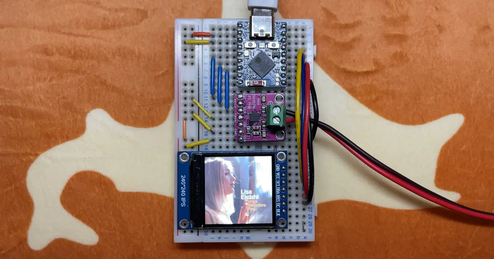

# ESP32-InternetRadio-with-CoverArt

**ESP32-S3 Internet Radio Receiver with Cover Art**

ESP32 を使ったインターネットラジオレシーバにカバーアートを表示させるための最小限のサンプルコードです。PlatformIO のプロジェクトになっています。ESP32 はデュアルコア・PSRAM搭載の機種である必要があります。

カバーアートの検索・取得には iTunes Search API を利用します。また、ストリーム再生中に HTTP アクセスをすると音飛びが発生するため、カバーアート取得部を別タスク化しコア０で動かすことで回避しています。

詳しくは[こちら](https://katayu.de/posts/esp32-s3-radio/)をご覧ください。

---

English (DeepL auto-translated) : 

This is a minimal example code to display cover art on an ESP32 based internet radio receiver.

The iTunes Search API is used to search and retrieve cover art. Also, HTTP access during stream playback causes sound skipping, which is avoided by making the cover art retrieval part a separate task and running it on core 0.

For more information, click [here](https://katayu.de/posts/esp32-s3-radio/) (Japanese).
